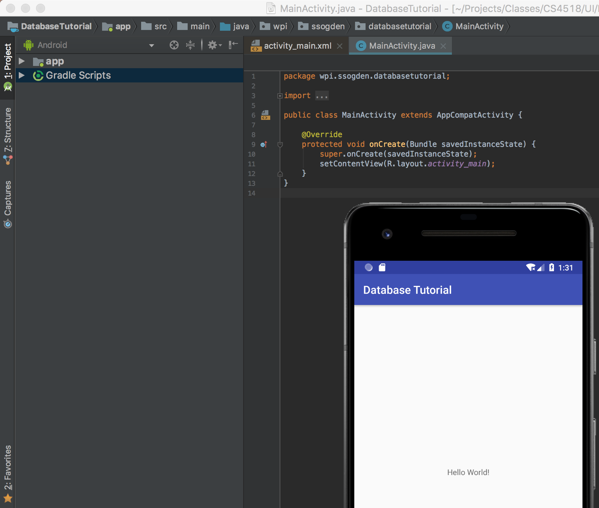
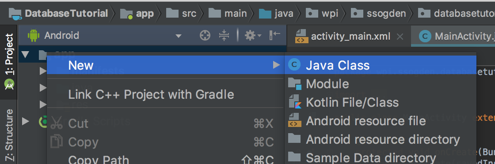
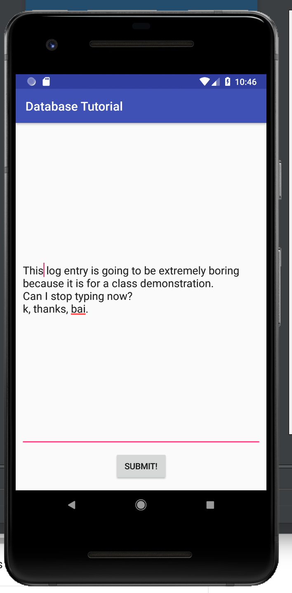
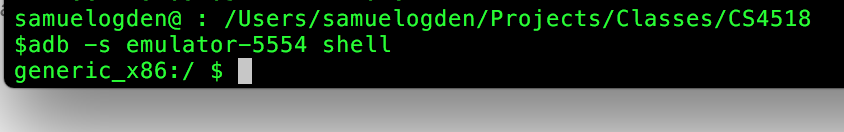

author: Sam Ogden
summary: CS4518 Android Database Tutorial
id: Database
categories: Storage, Databases
environment: java
status: draft

# CS4518 Android Application Database Tutorial
## Overview of Tutorial
Duration: 5 minutes

In this tutorial we'll be introducing you to the SQLite3 database system that's on android.  SQLite3 is a simple database system that saves your database as a file which makes it simple to get on and off of your device when you're ready to process it.

In this tutorial we'll be doing the following:

* Writing a logging application that uses a SQLite3 database on Android
* Setting up a simple DB struture on android
* Simple android text entry
* Inserting entered text, along with a timestamp, into the database
* Retrieving databases from your android device

Prerequisites:
* Android studio installed
* Simple GUI creation skills
* Basic DB knowledge
* ADB (Android Debugging Bridge) installed
    - Download and install instructions can be found at [https://developer.android.com/studio/command-line/adb](https://developer.android.com/studio/command-line/adb)
* SQLite3 installed on your computer
    - Download and install instructions can be found at [https://www.tutorialspoint.com/sqlite/sqlite_installation.htm](https://www.tutorialspoint.com/sqlite/sqlite_installation.htm)


## Make a New Project
Duration: 5 minutes

Similar to the UI tutorial you'll want to set up a new project.  This time, like last time, make it a blank project.
The only difference is that now you should name it something along the lines of "Database Tutorial" because I am still boring.
Again, pick an empty activity since it's more fun for us to build from scratch!




## Setting up your SQLite3 database classes

Android has largely built-in SQLite3 support meaning that integrating it into applications is relatively simple, if a bit low-level at times.  Doing so requires making two java classes.
The first is the contract class which defines how your database looks.  That is, it defines the columns and basic behavior.
The second class is the helper class which defines the creation and deletion of your database.  For example, this class defines the name of your database on disk as well as what happens when you change the version of your database.

### A very quick SQLite3 overview

SQLite3 is a database that is stored as a file on disk.  This makes it very easy to import and export SQLite3 databases, making them appealing to simple applications.  This also allows SQLite3 databases to be very simple to run and so are included in a number of popular projects, such as python.

However, this simplicity also means that SQLite3 has some limitations on features.  For instance, there are only 5 available datatypes in SQLite3: NULL, INTEGER, REAL, TEXT and BLOB.  This means that for more complex datatypes, such as timestamps, there has to be external logic in order to parse these fields.


### Designing your database

Our first step is to design our database.  Our first database will be super simple: just a log entry and a timestamp.  Therefore we just need two kinds of field, TEXT and REAL, for the entry and the timestamp respectively.

The first step is to make a new contract class.  To do this create a new javaclass titled `LogContract`.



Next, we add in a private constructor with `private LogContract() {}`.  This is done to ensure that this class can never be directly instanctiated.  

After this, we add in a private class, `LogEntry`, that extends BaseColumns and defines the name of our table and the columns in it.  This looks like the below.
```
public static class LogEntry implements BaseColumns {
    public static final String TABLE_NAME = "logEntries";

    public static final String COLUMN_NAME_ENTRY = "entry";
    ...
}
```

Finally, we need to define two strings that will create or delete our tables.  These take the form of SQL commands.  While in general these can be a bit complex, ours are relatively straight forward.  Below is the start of the creation string.

```
private static final String SQL_CREATE_ENTRIES =
        "CREATE TABLE " + LogEntry.TABLE_NAME + " (" +
                LogEntry._ID + " INTEGER PRIMARY KEY," +
                LogEntry.COLUMN_NAME_ENTRY + " TEXT," +
                ...
```

The deletion string is the reverse of this:
```
private static final String SQL_DELETE_ENTRIES =
    "DROP TABLE IF EXISTS " + LogEntry.TABLE_NAME;
```

Excellent!  Our contract class is all written so our database should be defined!

### General database management file

To make use of our contract class we need to make a helper class that will perform all of the actions needed for databases, as well as defining the aspects of our DB.

To do this we need to make another new class, `LogEntryDbHelper` which extends SQLiteOpenHelper.  There are three functions we need to implement: `onCreate`, `onUpgrade`, and `onDowngrade`.  These are largely implemented with the create and delete strings we defined in our `LogEntry` class.

```

public class LogEntryDbHelper extends SQLiteOpenHelper {
    // If you change the database schema, you must increment the database version.
    public static final int DATABASE_VERSION = 1;
    public static final String DATABASE_NAME = "LogEntries.db";

    public LogEntryDbHelper(Context context) {
        super(context, DATABASE_NAME, null, DATABASE_VERSION);
    }
    @Override
    public void onCreate(SQLiteDatabase db) {
        db.execSQL(...);
    }
    public void onUpgrade(SQLiteDatabase db, int oldVersion, int newVersion) {
        // This database is only a cache for online data, so its upgrade policy is
        // to simply to discard the data and start over
        db.execSQL(...);
        onCreate(db);
    }
    public void onDowngrade(SQLiteDatabase db, int oldVersion, int newVersion) {
        onUpgrade(db, oldVersion, newVersion);
    }

}
```

Okay!  Now our database is all setup and should be ready for us to call up and use in our code!  If we run our app we should see... absolutely nothing because we have yet to make a GUI.  Let's do that.

## Make a GUI!
Duration: 5 minutes

So let's make a simple GUI that includes a button and a text entry box and a text output box.  These have been in previous tutorials so you should be pros at this now.




## Using your database!

First things first, you need to instantiate your helper object so you can use it.  Doing this in your onCreate allows you to use it throughout.  Create a LogEntryDbHelper called `mDbHelper`.
To add entries to your db you need to get a writable object.  You get this by calling `getWriteableDatabase()` on your dbHelper object.

Finally you're ready to add objects to your DB!

First, you need to create a `ContentValues` object to which you add your column values using `put(_name_, _value_)`
Next, you should find how to capture your two values.  Remember, these are the text from your editText field and the timestamp when your data is submitted.

Once you have your values object add values you can use the `insert(...)` value on your db to add these values to your DB.


### Clearing for the next entry

Now we should prep the textbox to accept the next entry.  We can do this by using the `setText(...)` function on the editText element and setting it to an empty string.

### Counting the database entries

Just pushing data into our database doesn't give any sort of nice feedback.  Let's fix this by using that textView box we created during the GUI phase.

To do this let's make a new function, `updateLogCount()` that we can call from anywhere.  This function will connect to the DB as a read database and read the number of entries.

To create this function you need use `getReadableDatabase()` to get a connection to read data from the database, and `DatabaseUtils.queryNumEntries(...)` to count the number of entries.  

After you're done it should look like this:


 
## Entering some text to test it out!
Duration: 2 minutes

Okay!  Now just enter some text to your app, click the button and watch the counter go up!  It's like a fun(?) game with graphics created by you!


## Getting your database from your device!
Duration: 15 minutes

There are much better tutorials than this for actually using ADB and SQLite3 and so I would recommend looking around a bit to find them.  However, for the quick and dirty "getting your database off your device" this should get you started and your database backed up.

First thing to do is to fire up your favorite terminal application and navigate to a folder that you want to store your database in.

### Seeing what devices are attached

Next, we'll want to see what devices you have attached.  These will be all the AVDs or real devices attached to your computer.  The command to see this information is `adb devices`


If you only have a single device it will default to that one but if you have multiple you will have to specify which one you want to interact with using the `-s` flag.

### Basic shell interactions
Once you have your device ID the simplest way to interact with it is to pull up a shell connection to it.  You do this by using the shell command as below.



This shell works with most simple linux commands, such as `ls`, but is limited in the permissions that is has.  This means there are many files that are off limits.  For instance, we can't get to our database file this way unless we use a different call.

### `run-as` flag
Similar to how you can use `su [user]` on a \*nix system, ADB allows you to add a `run-as` flag to the end of your shell command.  This can allow you to run as this application.  
This allows us to use our ID string as our user ID and thus be able to access files within the app's tree.


### Finding our database

Now that you have a quick idea how to run as your app it is time to find out database file and get it back to our computer.  
SQLite3 databases are located at `/data/data/[your app name]/databases/[your database name]`.  

So for me, my database is located at `/data/data/wpi.ssogden.databasetutorial/databases/LogEntries.db`.

Positive
: Note that because we are using `run-as` this path can be shorted to just the relative path from the home of the wpi.ssogden.databasetutorial app.  That is, so long as we are using `run-as` we can just use `databases/LogEntries.db`.

### Getting our database

There's two steps to getting this database off your device.  The first is to copy it to public shared storage and the second is to copy it from this public storage to off the device.

To copy the database to public storage we want to use the same shell command as before but instead of leaving it blank and getting a shell to work in we want to give it a specific command.  The format for this is:
```
adb -s [device_id] shell run-as [app_id] '[command]'
```

The command that we want to use is `cp [path_to_database] /sdcard`.  This will copy our database to the open external storage device.  

The next command is the `adb pull` command, which allows us to copy a file from our device to our computer.  We just use `adb -s [device_id] pull [file_location]` where the file location is now `/sdcard/[database_name]`.
Running this command we pull the file to our local system where we can load it into our favorite SQLite3 reader.


## More information

A lot more details about using SQLite3 on Android can be found at [https://developer.android.com/training/data-storage/sqlite](https://developer.android.com/training/data-storage/sqlite)

The main ADB information page is at [https://developer.android.com/studio/command-line/adb](https://developer.android.com/studio/command-line/adb) and is really helpful long term so I'd recommend giving it a good read over.
