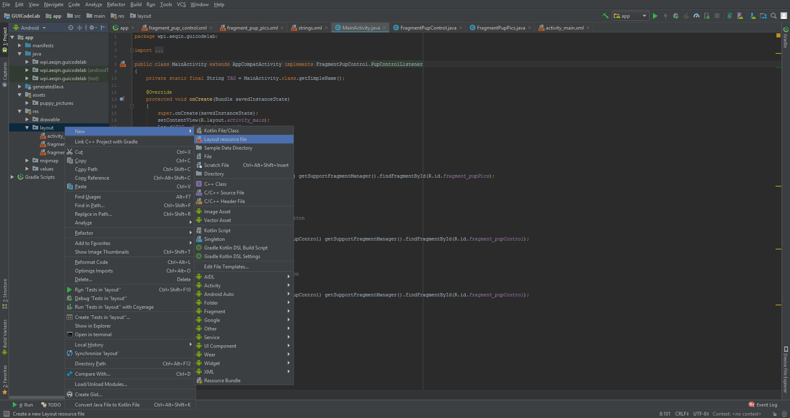
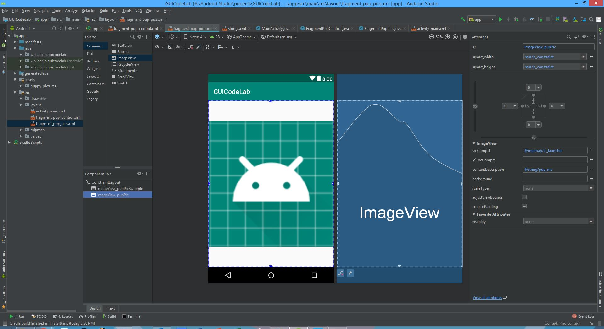
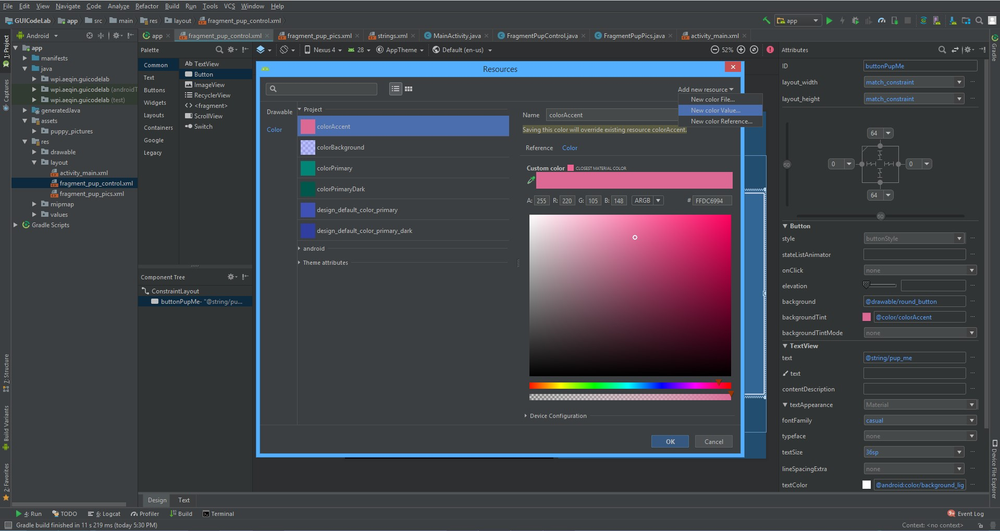
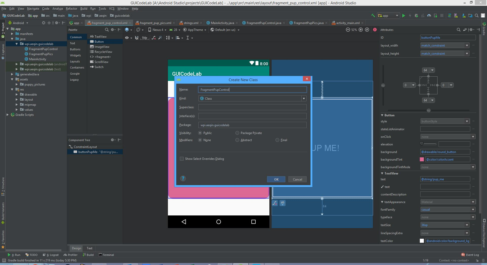
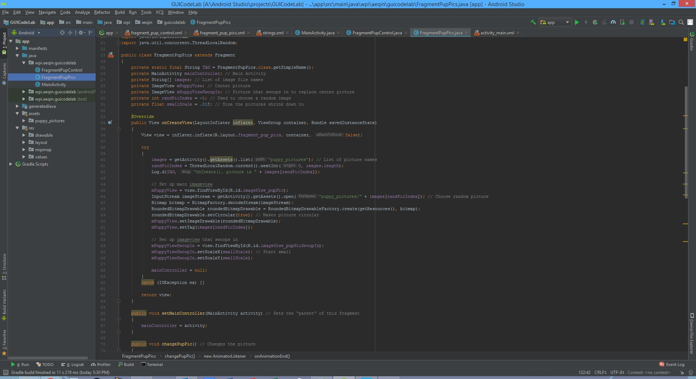
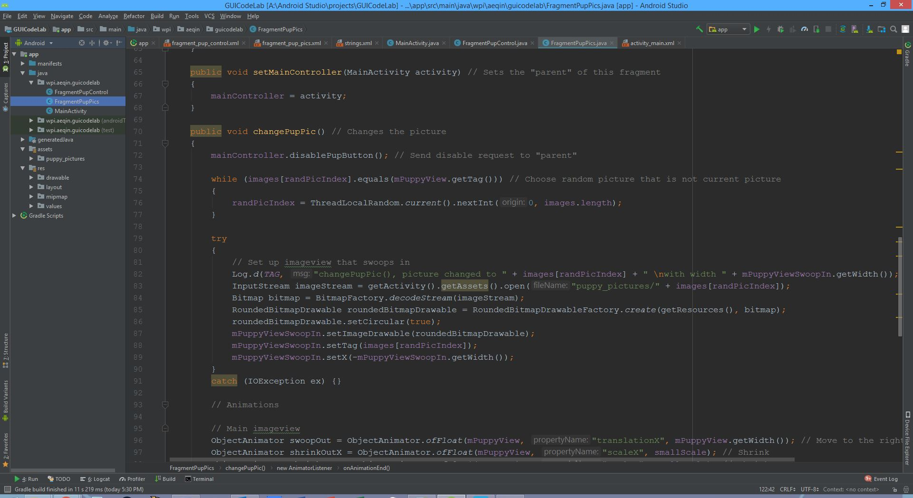
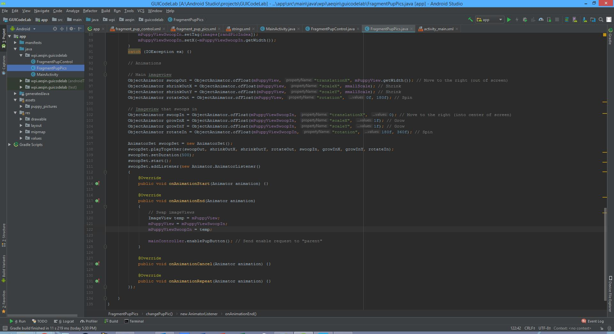
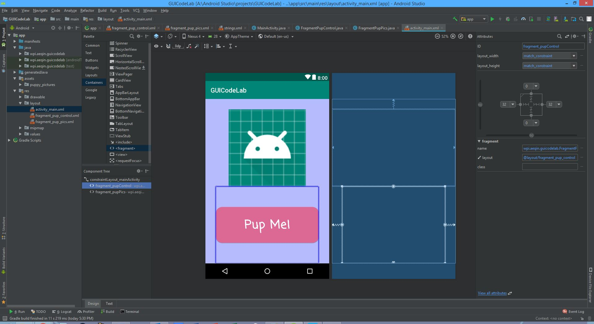

id: Project1Antony

# Antony Qin's Project1 PartB Tutorial
## Overview of Tutorial
Duration: ???

This tutorial will show you how to separate PartA code into fragments. Then it will also add animations and flair to the existing UI. In this tutorial you will do the following:

* Use fragments!
* Add transition animations to pictures!

Prerequisites:

* PartA of CS4518 Project1

## Miscellaneous: 
Duration: 0 - 5 minutes

### Migrate to AndroidX

* Go to `Refactor > Migrate to AndroidX...` and click on Migrate to AndroidX.

## Setting up the fragments:
Duration: ??? minutes

### Creating the fragment XML files
* PartA has a picture and a button, and we want to convert each to a fragment. Think of fragments as parts of an activity that do a specific task. One fragment will handle changing the picture. The other fragment will handle the button and send the request to change the picture.
* Make sure your project is in Android view. Navigate to `app > res > layout` and right click on layout. In the resulting menu, navigate to `new > layout resource file`.

* Name one fragment a name such as "fragment_pup_control.xml" and give it the ConstraintLayout. This will control the button.

* Create another fragment a name such as "fragment_pup_pics.xml" and the ConstraintLayout. This will control the picture.
* Drag two ImageViews into the ConstraintLayout.
    * One will be the picture the user sees, the other will swoop in on picture transistion.
* For each ImageView, modify the IDs. I used "imageView_pupPic" and "imageView_pupPicSwoopIn".
* Constrain each ImageView to the edges of its parent. I gave it constraints of 0 or each cardinal direction.
* Set layout_width and layout_height to match_constraint.

* Double click on "fragment_pup_control.xml", and go to design view.
* Drag a button into the ConstraintLayout.
* Modify the ID option, I used "buttonPupMe".
* Constrain it to the edges of its parent. I gave it constaints of 0 for left and right, and 64 for top and bottom.
* Set layout_width and layout_height to match_constraint.
* Navigate to the backgroundTint option and click on the three dots. Create an appealing color for the button and name it what you want.

* In the text option, input the text you want the button to display. I chose "Pup Me!"
    * You could also edit the "string.xml" file in `app > res > values` and link that to the text option.
* In order to make the button more appealing, one could round the corners.
    * Navigate to `app > res > drawable` and create a new XML file, I named mine round_button.xml.
    * Add this to the file:
    * Now in the background option, link in this new file.
* Remember to go to the textColor option and change the color to constrast with the backgroundTint color. Also modify textSize or fontFamily as you see fit.

### Creating the fragment java files
* Navigate to `app > java > wpi.[name].guicodelab` and right click. In the resulting menu, navigate to `new > java class`.

* Name the file something like "FragmentPupControl.java". This file will control the fragment containing the button.

* Create another class, and name the file something like "FragmentPupPics.java". This file will control the fragment containing the picture.

### Button Fragment java file
* Open the "FragmentPupControl.java" file.
* Add the following:

* The "PupControlListener" is an interface that will be used to force the MainActivity to implement the methods to change the picture and disable/enable the button.
* The overridden onAttach() function is used to attach this fragment to its parent (MainActivity).

### Picture Fragment java file
* Open the "FragmentPupControl.java" file.
* Add the following:

* In the "OnCreate()" function, a random image is being loaded from the folder of puppy pictures. The image is converted to a circle.
* The "setMainController()" function in order for this fragment to send requests to the MainActivity.
* Add the "changePupPic()" function. This function is used to change the picture by animating the picture exiting the screen, and animating the new replacement picture to take the place of the old picture.
    * This first statement of the function sends a request to disable the button to switch pictures while the pictures are in the process of animating.
    * The while loop chooses a random picture that is not the current picture.
    * Inside the try block, the new picture is selected and turned into a circle.
    

    
* Add the second part of the "changePupPic()" function.
    * The first 4 statements animate the old picture, letting it exit the right of the screen, shrink, and spin.
    * The second 4 statements animate the new picture coming in, letting it enter the left of the screen, grow, and spin.
    * The "swoopSet" variable is a AnimatorSet object that packages up all the animations, and plays them all at the same time.
        * At the end of the animations, swap the two imageview variables and send a request to reenable the button

## Refactoring up the main activity:
Duration: 10 minutes

### Modifying the activity_main XML file:
* Open the "activity_main.xml" file from PartA.
* Remove the Button and ImageView.
* Navigate to the Containers category in the Palette and drag in a <fragment>, select the class of the picture fragment.
* Drag in another <fragment>, select the class of the button fragment.
    

    
* Click on the picture fragment, change to design mode, and change the ID. I used "fragment_pupPics".
    * Give it constraints, I had 32 from the top, 0 from the left and right, and 0 at its bottom constrained to the button fragment.
    * Change layout_width and layout_height to match_constraint
    

    
* Click on the button fragment, change to design mode, and change the ID. I used "fragment_pupControl".
    * Give it constraints, I had 0 at its the top constrained to the picture fragment, 32 from the left and right, and 0 from the bottom.
    * Change layout_width and layout_height to match_constraint.
    

    
### Modifying the MainActivity.java file:
* Open the "MainActivity.java" file from PartA.
* Modify it until it looks like the following:

* "MainActivity" implements the interface from the button fragment so it guarantees it implements the methods to change the picture, and disable/enable the buttons.
* In each of these guaranteed methods, the main activity grabs the fragment in control of the function and calls the method associated from the fragment

