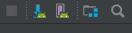
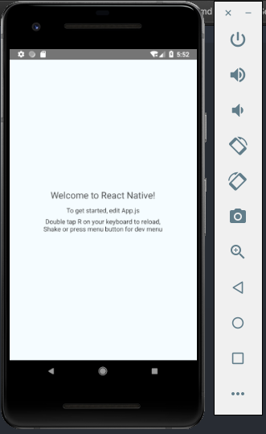
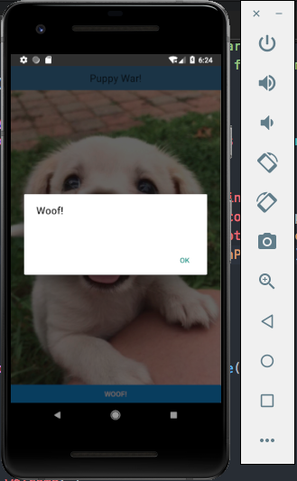
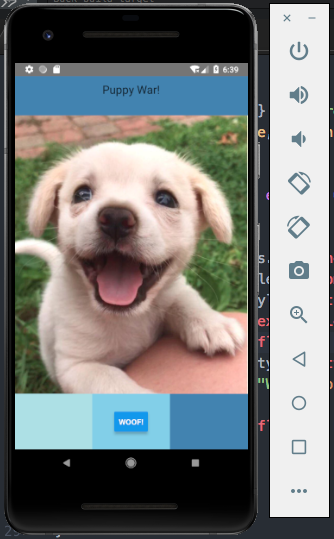
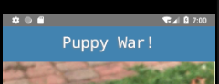
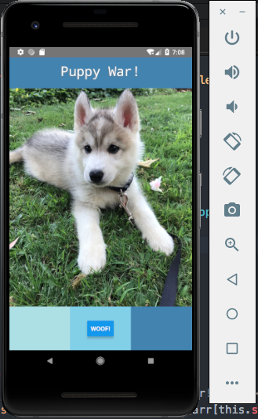

id: Project1Kit

# CS4518 How-to: UI Mutation in React Native - By Karitta Zellerbach
###### Karitta Zellerbach

## Overview of Tutorial 

This tutorial will show you how to create a basic Android app from scratch using React Native.

Prerequisites:

* Android Studio 3.2
* Android physical or virtual devices API 27
* Text Editor (I suggest Atom)
* Homebrew (Mac)
* Curiosity!

## Installation
First, in a terminal run the commands:

```
brew install node
brew install watchman
npm install -g react-native-cli
```

Next, you will need to add some variables to your 
`$HOME/.bash_profile config` file

Specifically the lines:

```
export ANDROID_HOME=$HOME/Library/Android/sdk
export PATH=$PATH:$ANDROID_HOME/tools
export PATH=$PATH:$ANDROID_HOME/tools/bin
export PATH=$PATH:$ANDROID_HOME/platform-tools
export PATH=$PATH:$ANDROID_HOME/emulator
```

If you are on a windows computer, instructions can be found at [React Native - Getting Started](https://facebook.github.io/react-native/docs/getting-started).

## Create the App

Now we're ready to create our app. Open the terminal and type
`react-native init PetWar`. You'll notice that this just created a lot of folders in this new PetWar directory and also the file `App.js`.
This is the file that we will be editing!

Now before we start, make sure you have an AVD running. To do so, click the purple button to open the AVD Manager.



Then click the green arrow to run the AVD.


Now, back in terminal run
```
cd Project1
react-native run-android
```

You should see the app running on the AVD.


## Customization

We are finally ready to write some code. As you might have been able to tell by `App.js`, we will be writing code in Javascript. Now, open `App.js` in a text editor. I recommend Atom, but you can choose your favorite.

Now when you open `App.js` you'll see the code below. This code is a pretty good starting point, but we're going to need to make some changes! Also don't worry if you don't know what it means, we'll take it step by step.

```javascript
/**
 * Sample React Native App
 * https://github.com/facebook/react-native
 *
 * @format
 * @flow
 */

import React, {Component} from 'react';
import {Platform, StyleSheet, Text, View} from 'react-native';

const instructions = Platform.select({
  ios: 'Press Cmd+R to reload,\n' + 'Cmd+D or shake for dev menu',
  android:
    'Double tap R on your keyboard to reload,\n' +
    'Shake or press menu button for dev menu',
});

type Props = {};
export default class App extends Component<Props> {
  render() {
    return (
      <View style={styles.container}>
        <Text style={styles.welcome}>Welcome to React Native!</Text>
        <Text style={styles.instructions}>To get started, edit App.js</Text>
        <Text style={styles.instructions}>{instructions}</Text>
      </View>
    );
  }
}

const styles = StyleSheet.create({
  container: {
    flex: 1,
    justifyContent: 'center',
    alignItems: 'center',
    backgroundColor: '#F5FCFF',
  },
  welcome: {
    fontSize: 20,
    textAlign: 'center',
    margin: 10,
  },
  instructions: {
    textAlign: 'center',
    color: '#333333',
    marginBottom: 5,
  },
});
```

Let's start from the top...

```javascript
import React, {Component} from 'react';
import {Platform, StyleSheet, Text, View} from 'react-native';
```
These `import` statements are pretty great. If you try to run the app without them you'll find that you have a bunch of errors. They let us import modules to use in our app. You might notice the word `Platform`. This allows us to separate the code by platform (e.g. iOS and Android). However, since we're just focusing on Android in this tutorial, we can get rid of it.

Let's add some more modules that might be useful later.

```javascript
import {Text, View, Image, Button, Alert, StyleSheet} from "react-native";
```

Now let's add our first image. Make sure you have the image in the folder with App.js.
Let's add the image right below the "Welcome to React Native!" text component using the line:


```javascript
<Image source={require('./puppy.jpg')}/>
```

We can refresh the the AVD by double tapping the 'R' key.


That's a **big** puppy! Depending on your image, the scaling might be a little off. Let's fix that by setting our width and height to undefined, forcing it to fit to the width of it's parent. We're going to make these changes in the stylesheet. You may have noticed this line of code `<Text style={styles.welcome}>`. This means that specific Text component uses the style `welcome`, which is defined in the stylesheet.

```javascript
const styles = StyleSheet.create({
  container: {
    flex: 1,
    justifyContent: 'center',
    backgroundColor: '#F5FCFF',
  },
  welcome: {
    fontSize: 20,
    textAlign: 'center',
    margin: 10
    backgroundColor: 'steelblue'
  },
  photo: {
    width: undefined,
    height: undefined,
    flex: 1,
    justifyContent: 'center'
  }
});
```
Now let's refresh our app again.


Much better! But now we should update our text. Change the text from "Welcome to React Native!" to anything you want. We're also going to change the background color. To do this, we can just add the backgroundColor into the stylesheet. I've chosen steelblue.

```javascript
welcome: {
  fontSize: 20,
  textAlign: 'center',
  margin: 10,
  backgroundColor: 'steelblue'
}
```


Hmmm... that doesn't look too great. Let's see what happens when we change the word `margin` to `padding` in the stylesheet.


Looking pretty snazzy! You'll notice the difference between the two. Padding refers to the amount of space within the component, while margin specifies the area outside.

Now let's add a button.

```javascript
<Button title="Woof!" onPress={() => {Alert.alert("Woof!");}}/>
```
The `onPress` property is required for buttons in React Native. In this instance, we're creating an alert that will say "Woof!" when the user presses the button.




Still looking a little boring though. Let's fix that by adding some views around the button.

```javascript
<View style={{ flex: 0.5, backgroundColor: "skyblue" }} />
<Button title="Woof!" onPress={() => {Alert.alert("Woof!");}}/>
<View style={{ flex: 0.5, backgroundColor: "powderblue" }} />
```


That looks much better. But I notice you have a question on your mind... what is `flex` you ask? Well, `flex` takes values to scale components proportionally. So a component with flex set to 2 will take twice the space as a component with flex set to 1. I personally prefer this to hardcoding values!


Moving on, the button looks a little wide don't you think? Let's wrap a view around it so we can center it. First we'll have to create the style for the view. I've created one called `buttonSection`.

```javascript
buttonSection: {
flex: 1,
justifyContent: "center",
alignItems: "center",
backgroundColor: "skyblue"
}
```

Now we just need to add ```<View style={styles.buttonSection}> .... </View>``` around the button.


While we're at it, let's take it one step further. Let's make the colors line up in a row. We can do this by specifying the flexDirection to row in the parent component, which means that the child components inside it will now be organized horizontally.

```javascript
<View style={{flex: 1, flexDirection: 'row'}}>
  <View style={{flex: 1, backgroundColor: 'powderblue'}} />
  <View style={styles.buttonSection}>
    <Button title="Woof!" onPress={() => {Alert.alert("Woof!");}}/>
  </View>
  <View style={{flex: 1, backgroundColor: 'steelblue'}} />
</View>
```



Now that's a color gradient! Let's make some final changes to the styling. I don't know about you, but that Puppy War text is still pretty boring.

```javascript
welcome: {
  flex: 0.5,
  fontSize: 20,
  textAlign: 'center',
  padding: 10,
  backgroundColor: 'steelblue',
  textShadowColor: 'grey',
  textShadowOffset: {width: -1, height: 1},
  textShadowRadius: 10,
  fontFamily: 'monospace',
  fontSize: 30,
  color: 'white'
},
```
You can add however many properties you want. I've chosen to make the text a little bigger and have given it a grey shadow, as well as setting the font to monospace.




Alright we're almost done! I think we should just add some more puppy photos for good measure. You can add as many photos as you like. We're going to store them in an array outside our `App` class.

```javascript
var arr = [
  { image: require("./puppy.jpg") },
  { image: require("./puppy2.jpg") },
  { image: require("./puppy3.jpg") }
];

export default class App extends Component<Props> {
```

But wait...how are we going to keep track of which puppy to show? We're going to need a variable we can retrieve and update. This is where states are handy! States are Javascript objects that are managed within the component, just like class variables.

We're going to use a constructor to define the initial state, which will be the first puppy image (index = 0).

```javascript
constructor(props) {
  super(props);
  this.state = {
    counter: 0
  };
}
```

Now we can change the source of our image to our puppy image array.

```javascript
source={arr[this.state.counter].image}
```

We just need to increment the counter somehow... maybe that onPress() function will come in handy.

```javascript
<Button title="Woof!" onPress={() =>
  {Alert.alert("Woof!");
  if (this.state.counter == arr.length-1){
      this.setState({ counter: 0 });
    } else {
      this.setState({ counter: this.state.counter + 1 });
    }
  }}/>
```

Indeed it did! We also have to check if the current index is the last index of the array, in which case we have to go back to 0 to avoid any out of bounds exceptions.



I think this looks pretty good for a first React Native app. Good job!

## Summary and Resources
In this tutorial we've created an Android App from scratch using React Native.

However, if you don't want to create an app from scrach and are interested in how to integrate your existing Android app to React Native [this website](https://facebook.github.io/react-native/docs/integration-with-existing-apps) provides a great tutorial.


